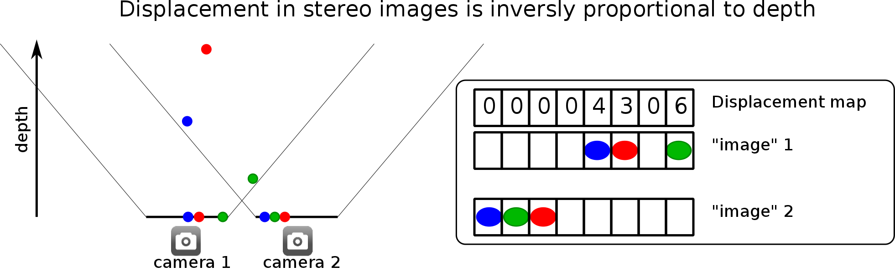
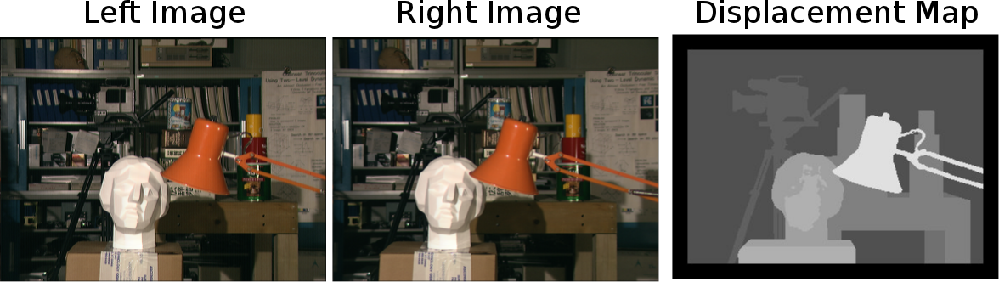
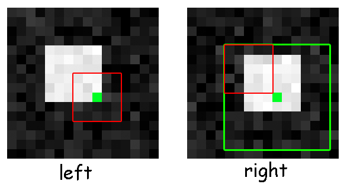
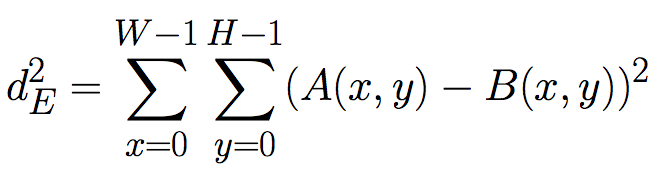
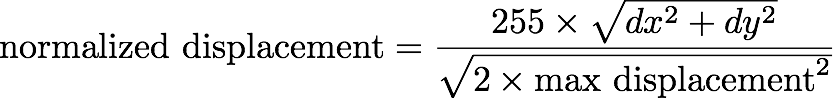
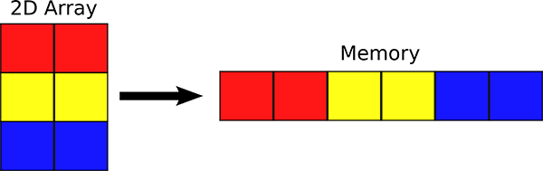
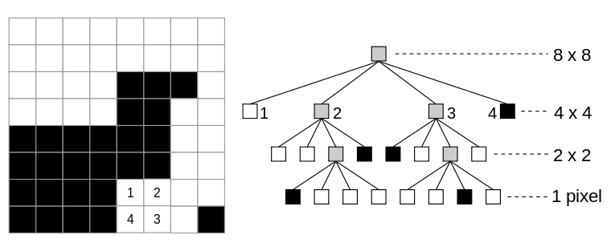
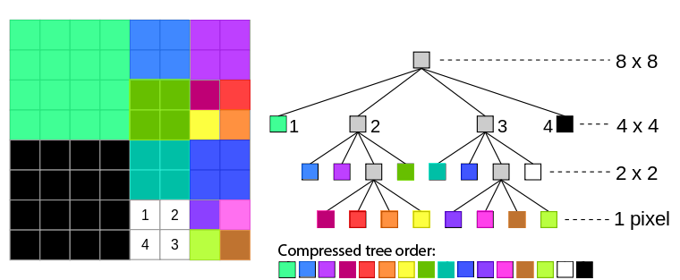
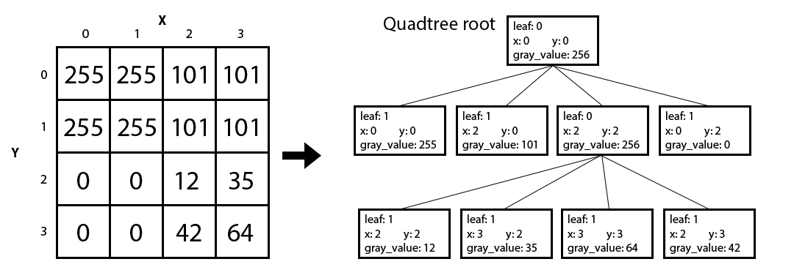

# Shape From Stereo

This project simulates depth perception using image analysis by generating a depth map that calculates the differences in colouration between two images that represent what is seen by the left and right eyes. It also implements a quadtree compression algorithm as an effective way of storing depth maps which are square compared to bitmaps because depth maps tend to have many homogeneous sections.

### Background

Cameras traditionally capture a two dimensional projection of a scene. However depth information is important for many real-world application including robotic navigation, face recognition, gesture or pose recognition, 3D scanning, and self-driving cars. The human visual system can preceive depth by comparing the images captured by our two eyes. This is called stereo vision. In this project we will experiment with a simple computer vision/image processing technique, called "shape from stereo" that, much like humans do, computes the depth information from stereo images (images taken from two locations that are displaced by a certain amount).

### Depth Perception

Humans can tell how far away an object is by comparing the position of the object is in left eye's image with respect to right eye's image. If an object is really close to you, your left eye will see the object further to the right, whereas your right eye will see the object to the left. A similar effect will occur with cameras that are offset with respect to each other as seen below.



The above illustration shows 3 objects at different depth and position. It also shows the position in which the objects are projected into image in camera 1 and camera 2. As you can see, the closest object (green) is displaced the most (6 pixels) from image 1 to image 2. The furthest object (red) is displaced the least (3 pixels). We can therefore assign a displacement value for each pixel in image 1. The array of displacements is called displacement map. The figure shows the displacement map corresponding to image 1.

Finding the displacement map using a simple block matching algorithm. Since images are two dimensional we need to explain how images are represented before going to describe the algorithm.

Below is a classic example of left-right stereo images and the displacement map shown as an image.



### Objective

We will attempting to simulate depth perception on the computer, by writing a program that can distinguish far away and close by objects.

We will implement a depth map generator. This function takes two input images (unsigned char *left and unsigned char *right), which represent what you see with your left and right eye, and generates a depth map using the output buffer we allocate (unsigned char *depth_map).

### Generating Depth Map

In order to achieve depth perception, we will be creating a depth map. The depth map will be a new image (same size as left and right) where each "pixel" is a value from 0 to 255 inclusive, representing how far away the object at that pixel is. In this case, 0 means infinity, while 255 means as close as can be. Consider the following illustration:



The first step is to take a small patch (here 5x5) around the green pixel. This patch is represented by the red rectangle. We call this patch a feature. To find the displacement, we would like to find the corresponding feature position in the other image. We can do that by comparing similarly sized features in the other image and choosing the one that is the most similar. Of course, comparing against all possible patches would be very time consuming. We are going to assume that there's a limit to how much a feature can be displaced -- this defines a search space which is represented by the large green rectangle (here 11x11). Notice that, even though our images are named left and right, our search space extends in both the left/right and the up/down directions. Since we search over a region, if the "left image" is actually the right and the "right image" is actually the left, proper distance maps should still be generated.

The feature (a corner of a white box) was found at the position indicated by the blue square in the right image.

We'll say that two features are similar if they have a small Squared Euclidean Distance. If we're comparing two features, A and B, that have a width of W and height of H, their Squared Euclidean Distance is given by:



Once we find the feature in the right image that's most similar, we check how far away from the original feature it is, and that tells us how close by or far away the object is.

### Definitions (Inputs)
We define the variables feature_width and feature_height which result in feature patches of size: (2 × feature_width + 1) × (2 × feature_height + 1). In the previous example, feature_width = feature_height = 2 which gives a 5×5 patch. We also define the variable maximum_displacement which limits the search space. In the previous example maximum_displacement = 3 which results in searching over (2 × maximum_displacement + 1)^2 patches in the second image to compare with.

### Definitions (Output)
In order for our results to fit within the range of a unsigned char, we output the normalized displacement between the left feature and the corresponding right feature, rather than the absolute displacement. The normalized displacement is given by:



In the case of the above example, dy=1 and dx=2 are the vertical and horizontal displacement of the green pixel. This formula will guarantee that we have a value that fits in a unsigned char, so the normalized displacement is 255 × sqrt(1 + 22)/sqrt(2 × 32) = 134, truncated to an integer.

### Bitmap Images

We will be working with 8-bit grayscale bitmap images. In this file format, each pixel takes on a value between 0 and 255 inclusive, where 0 = black, 255 = white, and values in between to various shades of gray. Together, the pixels form a 2D matrix with image_height rows and image_width columns.

Since each pixel may be one of 256 values, we can represent an image in memory using an array of unsigned char of size image_width * image_height. We store the 2D image in a 1D array such that each row of the image occupies a contiguous part of the array. The pixels are stored from top-to-bottom and left-to-right (see illustration below):



We can refer to individual pixels of the array by specifying the row and column it's located in. Recall that in a matrix, rows and columns are numbered from the top left. We will follow this numbering scheme as well, so the leftmost red square is at row 0, column 0, and the rightmost blue square is at row 2, column 1. In this project, we will also refer to an element's column # as its x position, and it's row # as its y position. We can also call the # of columns of the image as its image_width, and the # of rows of the image as its image_height. Thus, the image above has a width of 2, height of 3, and the element at x=1 and y=2 is the rightmost blue square.

We will generates a depth map and stores it in unsigned char *depth_map, which points to a pre-allocated buffer of size image_width × image_height. Two images, left and right are provided. They are also of size image_width × image_height. The feature_width and feature_height parameters are described in the Generating a depth map section.

### Implementation details:

A feature is a box of width (2 × feature_width + 1) and height (2 × feature_height + 1) , with the original position of the pixel at its center. It is not assumed that feature_height = feature_width = maximum_displacement. They may all be different (e.g. the feature box may be a rectangle). Pixels on the edge of the image, whose left-image features don't fit inside the image, should have a normalized displacement of 0 (infinite). When maximum_displacement is 0, the whole image would have a normalized displacement of 0. The algorithm should not consider right-image features that lie partially outside the image area. However, if the left-image feature of a pixel is fully within the image area, we should always be able to assign a normalized displacement to that pixel. The source pixels always come from unsigned char *left, whereas the unsigned char *right image is always the one that is scanned for nearby features. It is not assumed that unsigned char *depth_map has been filled with zeros. Ties in the Euclidean Distance should be won by the one with the smallest resulting normalized displacement.

### Quadtree Compression

The depth maps that we create in this project are just 2D arrays of unsigned char. When we interpret each value as a square pixel, we can output a rectangular image. We used bitmaps in this project, but it would be incredibly space inefficient if every image on the internet were stored this way, since bitmaps store the value of every pixel separately. Instead, there are many ways to compress images (ways to store the same image information with a smaller filesize). We implement one type of compression using a data structure called a quadtree.

A quadtree is similar to a binary tree, except each node must have either 0 children or 4 children. When applied to a square bitmap image whose width and height can be expressed as 2^N, the root node of the tree represents the entire image. Each node of the tree represents a square sub-region within the image. We say that a square region is homogenous if its pixels all have the same value. If a square region is not homogenous, then we divide the region into four quadrants, each of which is represented by a child of the quadtree parent node. If the square region is homogeneous, then the quadtree node has no children and instead, has a value equal to the color of the pixels in that region.

We continue checking for homogeneity of the image sections represented by each node until all quadtree nodes contain only pixels of a single grayscale value. Each leaf node in the quadtree is associated with a square section of the image and a particular grayscale value. Any non-leaf node will have a value of 256 (outside the grayscale range) associated with it, and should have 4 child nodes.



We will be numbering each child node created (1-4) clockwise from the top left square, as well with their ordinal direction (NW, NE, SE, SW). When parsing through nodes, we will use this order: 1: NW, 2: NE, 3: SE, 4: SW.

Given a quadtree, we can choose to only keep the leaf nodes and use this to represent the original image. Because the leaf nodes should contain every color value represented, the non-leaf nodes are not needed to reconstruct the image. This compression technique works well if an image has large regions with the same grayscale value (artificial images), versus images with lots of random noise (real images). Depth maps are a relatively good input, since we get large regions with similar depths.



The representation should use a tree of qNodes, all of which either have 0 or 4 children. The declaration of the struct qNode is in quadtree.h.

A few key points regarding the quadtree representation:

Leaves should have the boolean value leaf set to true, while all other nodes should have it as false. The gray_value of leaves should be set to their grayscale value, but non-leaves should take on the value 256. The x and y variables should hold the top-left pixel coordinate of the image section the node represents. We only require that our code works with images that have widths that are powers of two. This means that all qNode sizes will also be powers of two and the smallest qNode size will be one pixel. The four child nodes are marked with ordinal directions (NW, NE, SE, SW), which should match closely to the corresponding sections of the image. 

The following example illustrates these points:



### Debugging and Testing

The code is compiled with the -g flag, so CGDB can be used for debugging the programs. Glance through the avaiable options in Makefile. There are some well defined test cases.

```bash
make clean
make run
```

### Acknowledgment

The project <a href="https://inst.eecs.berkeley.edu/~cs61c/fa14/projs/01/">spec</a> is taken from UC Berkeley CS61C.